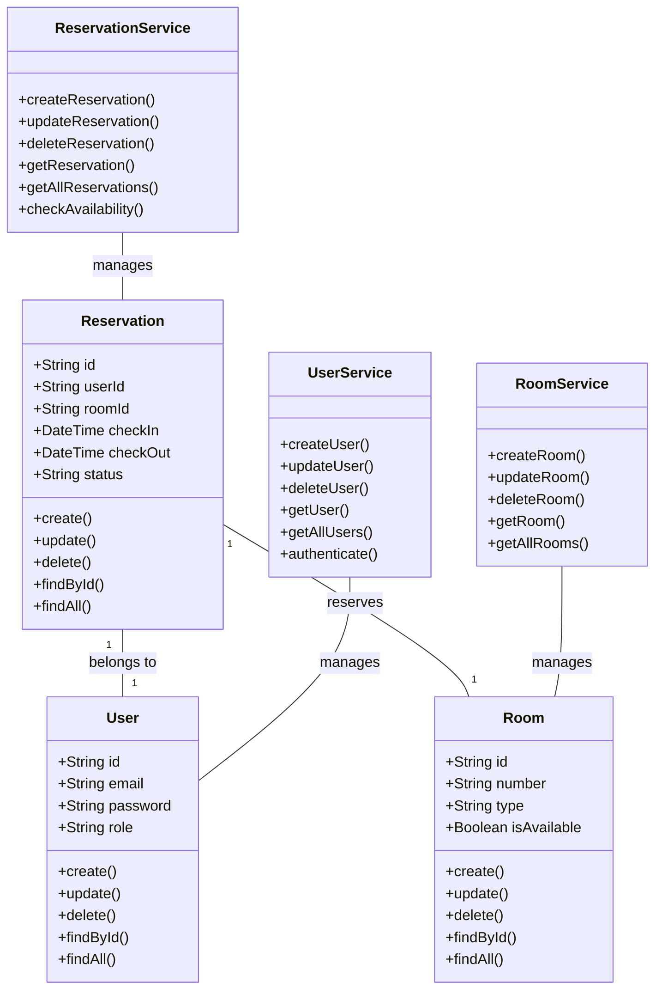
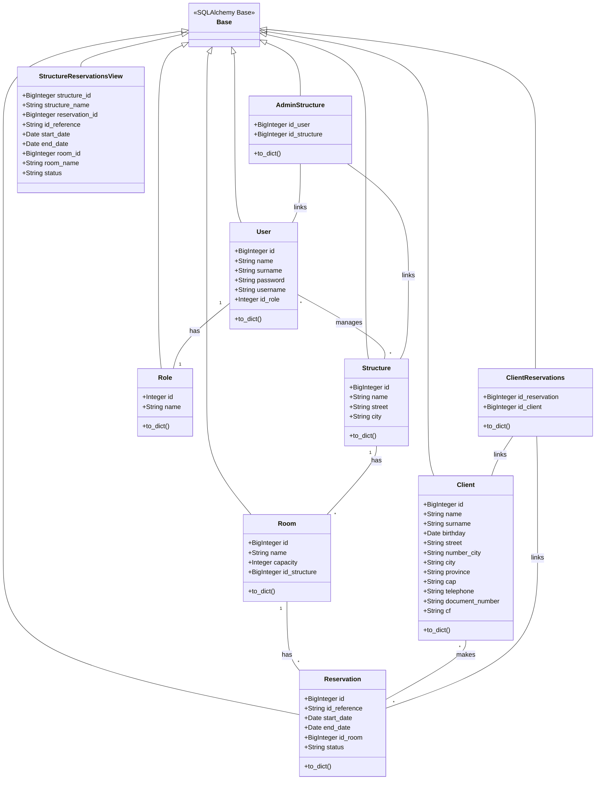

<!-- This is an auto-generated reply by CodeRabbit -->
> [!TIP]
> For best results, initiate chat on the files or code changes.

<details>
<summary>🧩 Analysis chain</summary>

@mrgionsi Here's the class diagram of your backend package and a README documentation:



# Backend Package Documentation

## Overview
The backend package implements a hotel reservation system with three main entities: Users, Rooms, and Reservations. The system follows a service-oriented architecture pattern where each entity has its own service class handling business logic.

## Core Components

### Models

#### User
- Represents system users (guests and administrators)
- Properties: id, email, password, role
- Supports CRUD operations

#### Room
- Represents hotel rooms
- Properties: id, number, type, isAvailable
- Supports CRUD operations

#### Reservation
- Represents room bookings
- Properties: id, userId, roomId, checkIn, checkOut, status
- Supports CRUD operations

### Services

#### UserService
- Handles user-related operations
- Manages user authentication
- Provides user CRUD operations

#### RoomService
- Manages room inventory
- Handles room availability
- Provides room CRUD operations

#### ReservationService
- Manages booking process
- Handles reservation lifecycle
- Provides reservation CRUD operations
- Implements availability checking logic

## Architecture
- Uses a layered architecture with clear separation of concerns
- Models represent data structures
- Services implement business logic
- Each entity has its own service class for better maintainability

## Data Flow
1. Client requests are received through API endpoints
2. Requests are processed by appropriate service classes
3. Services interact with models to perform operations
4. Results are returned to the client

## Security
- User authentication is handled by UserService
- Role-based access control is implemented
- Sensitive data like passwords are properly secured

## Future Improvements
1. Implement caching for frequently accessed data
2. Add payment processing integration
3. Implement notification system for reservations
4. Add logging and monitoring

Would you like me to explain any specific part in more detail?

---

🏁 Script executed:
```
#!/bin/bash
# Find all files in the backend package
fd . backend/
```

Length of output: 332

---

🏁 Script executed:
```
#!/bin/bash
# Read the contents of all backend files
for file in $(fd . backend/); do
  echo "=== $file ==="
  cat "$file"
  echo -e "\n\n"
done
```

Length of output: 38391

---


</details>

@mrgionsi Here's an updated class diagram and README based on the actual implementation:



# Remote Check-in System Backend

## Overview
A Flask-based backend system for managing hotel room reservations, supporting multiple structures (hotels), rooms, and clients.

## Architecture

### Core Components

#### Models
- **Structure**: Represents a hotel/building
  - Properties: id, name, street, city
  - Relationships: has many rooms

- **Room**: Represents individual rooms
  - Properties: id, name, capacity, structure_id
  - Relationships: belongs to structure, has many reservations

- **Reservation**: Manages bookings
  - Properties: id, reference_id, start_date, end_date, room_id, status
  - Relationships: belongs to room, has many clients

- **Client**: Represents guests
  - Properties: id, name, surname, contact details, documents
  - Relationships: has many reservations

- **User**: System users (admins/staff)
  - Properties: id, name, surname, username, password, role_id
  - Relationships: has one role, manages many structures

#### Views
- **StructureReservationsView**: Aggregates structure and reservation data
  - Provides a denormalized view for efficient querying

### API Endpoints

#### Rooms
- `POST /api/v1/rooms`: Create new room
- `GET /api/v1/rooms`: List rooms by structure
- `GET /api/v1/rooms/<id>`: Get room details
- `DELETE /api/v1/rooms/<id>`: Remove room

#### Reservations
- `POST /api/v1/reservations`: Create reservation
- `GET /api/v1/reservations`: List all reservations
- `GET /api/v1/reservations/<structure_id>`: List structure's reservations
- `GET /api/v1/reservations/monthly/<structure_id>`: Get monthly reservation stats

## Technical Stack
- **Framework**: Flask
- **ORM**: SQLAlchemy
- **Database**: PostgreSQL (production), SQLite (testing)
- **Testing**: pytest

## Development Setup
1. Install dependencies:
   ```bash
   pip install -r requirements.txt
   ```

2. Configure environment variables:
   - Create `.env` file with database credentials
   - Set `DB_USER`, `DB_PASSWORD`, `DB_HOST`, `DB_PORT`, `DB_NAME`

3. Run tests:
   ```bash
   pytest
   ```

4. Start development server:
   ```bash
   python main.py
   ```

## Testing
- Comprehensive test suite using pytest
- Separate test configuration using SQLite
- Tests cover all major API endpoints
- Includes positive and negative test cases

## Security Features
- Role-based access control
- Password protection for users
- Environment-based configurations
- Session management

## Future Improvements
1. Add API authentication
2. Implement rate limiting
3. Add caching layer
4. Enhance error handling
5. Add API documentation using Swagger/OpenAPI

Would you like me to explain any specific part in more detail?